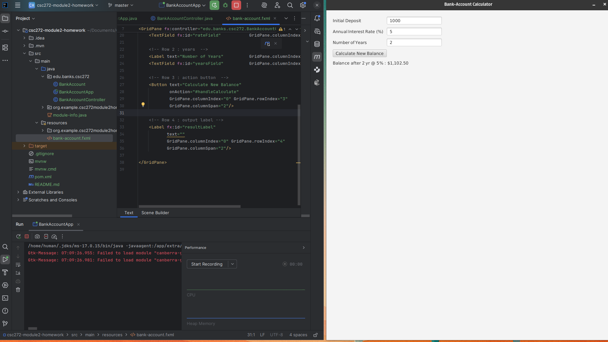
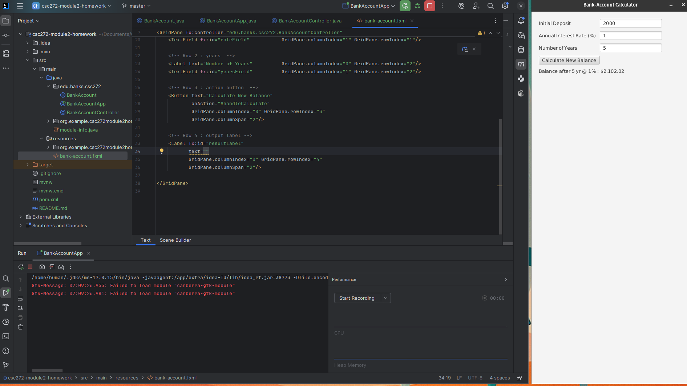

# CSC272 – Advanced Java Programming  
## Module 2 Assignment – Balance Calculator & JavaFX Practice

**Student:** Zachary Banks  
**ID #:** 900648740  
**Week #:** 2  
**E‑mail:** z.banks8740@student.nu.edu  

---

## Problem 1 – Swing / Basic GUI Balance Calculator

### Source Files  
*(paste your full listings in the matching blocks)*

<details>
<summary><code>BankAccount.java</code></summary>

```java
/* ===============================================================
 *  BankAccount.java
 * =============================================================== */
package edu.banks.csc272;

/** Encapsulates a single savings account balance. */
public class BankAccount {

    private double balance;                /* current amount $ */

    public BankAccount(double initialDeposit) { balance = initialDeposit; }

    /** Compound annually at rate r for n years. */
    public void addInterest(double ratePct, int years) {
        double r = ratePct / 100.0;
        balance = balance * Math.pow(1 + r, years);
    }

    public double getBalance() { return balance; }
}

````

</details>

<details>
<summary><code>BankAccountApp.java</code></summary>

```java
/* ===============================================================
 *  BankAccountApp.java
 *  ---------------------------------------------------------------
 *  JavaFX entry‑point for the Module‑2 GUI (Lecture 4 reference)
 * =============================================================== */
package edu.banks.csc272;

import javafx.application.Application;
import javafx.fxml.FXMLLoader;
import javafx.scene.Scene;
import javafx.stage.Stage;

/** Launches the Bank‑Account compound‑interest calculator. */
public class BankAccountApp extends Application {

    @Override                       /* JavaFX lifecycle hook — L4 */
    public void start(Stage stage) throws Exception {

        /* Load scene‑graph from FXML (MVC decoupling — L3) */
        Scene scene = new Scene(
                FXMLLoader.load(
                        getClass().getResource("/bank-account.fxml")
                )
        );

        stage.setTitle("Bank‑Account Calculator");
        stage.setScene(scene);
        stage.show();               /* paints the window — L4 */
    }

    /* Traditional Java entry‑point -> boots the JavaFX runtime. */
    public static void main(String[] args) { launch(args); }
}

```

</details>

<details>
<summary><code>BankAccountController.java</code></summary>

```java
/* ===============================================================
 *  BankAccountController.java
 *  ---------------------------------------------------------------
 *  Handles UI events for bank‑account.fxml  (Lectures 2–4)
 * =============================================================== */
package edu.banks.csc272;

import javafx.fxml.FXML;
import javafx.scene.control.Label;
import javafx.scene.control.TextField;

import java.text.NumberFormat;

/** Calculates balance = P·(1+r)<sup>n</sup> when the user presses the button. */
public class BankAccountController {

    /* ---------- FXML‑injected widgets (Lecture 3) ---------- */
    @FXML private TextField depositField;  /* principal P          */
    @FXML private TextField rateField;     /* rate r % per yr      */
    @FXML private TextField yearsField;    /* years n              */
    @FXML private Label     resultLabel;   /* output banner        */

    /* ---------- Format helpers (Lecture 2 utility classes) ---------- */
    private static final NumberFormat MONEY   = NumberFormat.getCurrencyInstance();
    private static final NumberFormat PERCENT = NumberFormat.getPercentInstance();
    static { PERCENT.setMinimumFractionDigits(0); }

    /* onAction handler wired in FXML (#handleCalculate) */
    @FXML
    private void handleCalculate() {

        try {                                /* L1 defensive parse */
            double principal = Double.parseDouble(depositField.getText().trim());
            double ratePct   = Double.parseDouble(rateField.getText().trim());
            int    years     = Integer.parseInt(yearsField.getText().trim());

            if (principal < 0 || ratePct < 0 || years < 0)
                throw new NumberFormatException("negative");

            /* compound‑interest math — P·(1+r)^n                (Lecture 2) */
            double r = ratePct / 100.0;
            double bal = principal * Math.pow(1 + r, years);

            /* show nicely‑formatted result (Lecture 4 UI update) */
            resultLabel.setText(String.format(
                    "Balance after %d yr @ %s : %s",
                    years,
                    PERCENT.format(r),
                    MONEY.format(bal)));

        } catch (NumberFormatException ex) { /* invalid input path */
            resultLabel.setText("❌  Enter non‑negative numeric values.");
        }
    }
}
```

</details>

<details>
<summary><code>bank‑account.fxml</code></summary>

```xml
<?xml version="1.0" encoding="UTF-8"?>

<?import javafx.geometry.Insets?>
<?import javafx.scene.control.*?>
<?import javafx.scene.layout.*?>

<GridPane fx:controller="edu.banks.csc272.BankAccountController"
          xmlns:fx="http://javafx.com/fxml"
          hgap="10" vgap="10">

    <!-- uniform 20‑px border -->
    <padding><Insets top="20" right="20" bottom="20" left="20"/></padding>

    <!-- Row 0 : principal -->
    <Label text="Initial Deposit"          GridPane.columnIndex="0" GridPane.rowIndex="0"/>
    <TextField fx:id="depositField"        GridPane.columnIndex="1" GridPane.rowIndex="0"/>

    <!-- Row 1 : rate -->
    <Label text="Annual Interest Rate (%)" GridPane.columnIndex="0" GridPane.rowIndex="1"/>
    <TextField fx:id="rateField"           GridPane.columnIndex="1" GridPane.rowIndex="1"/>

    <!-- Row 2 : years  -->
    <Label text="Number of Years"          GridPane.columnIndex="0" GridPane.rowIndex="2"/>
    <TextField fx:id="yearsField"          GridPane.columnIndex="1" GridPane.rowIndex="2"/>

    <!-- Row 3 : action button  -->
    <Button text="Calculate New Balance"
            onAction="#handleCalculate"
            GridPane.columnIndex="0" GridPane.rowIndex="3"
            GridPane.columnSpan="2"/>

    <!-- Row 4 : output label -->
    <Label fx:id="resultLabel"
           text=""
           GridPane.columnIndex="0" GridPane.rowIndex="4"
           GridPane.columnSpan="2"/>

</GridPane>
```

</details>

### Sample Run

   <!-- shows 1000‑unit test run -->

---

## Problem 2 – JavaFX & Scene Builder

### Part 1 – Project & Tool‑Chain Setup

I created a fresh **JavaFX Maven project** in IntelliJ IDEA 2024.1 using **JDK 17** and the *Form FX* template. After the first build I confirmed the default window launched. Next I downloaded **Scene Builder 20** from Gluon, installed it to `C:\SceneBuilder`, and registered the executable under **File → Settings → Languages & Frameworks → JavaFX → Path to Scene Builder**. Right‑clicking any FXML and choosing **Open in Scene Builder** now opens the layout designer, allowing drag‑and‑drop widgets and automatic wiring of `fx:id` and `onAction` callbacks.

> **Framework preference:** After implementing both versions, I prefer **JavaFX** over Swing—the FXML + Scene Builder workflow cleanly separates UI and logic, CSS styling feels modern, and visual layout is far faster than juggling nested Swing layout managers.

### Part 2 – JavaFX Balance Calculator Code
<details>
<summary><code>BankAccount.java</code></summary>

```java
/* ===============================================================
 *  BankAccount.java
 * =============================================================== */
package edu.banks.csc272;

/** Encapsulates a single savings account balance. */
public class BankAccount {

    private double balance;                /* current amount $ */

    public BankAccount(double initialDeposit) { balance = initialDeposit; }

    /** Compound annually at rate r for n years. */
    public void addInterest(double ratePct, int years) {
        double r = ratePct / 100.0;
        balance = balance * Math.pow(1 + r, years);
    }

    public double getBalance() { return balance; }
}

```

</details>

<details>
<summary><code>BankAccountApp.java</code></summary>

```java
/* ===============================================================
 *  BankAccountApp.java
 *  ---------------------------------------------------------------
 *  JavaFX entry‑point for the Module‑2 GUI (Lecture 4 reference)
 * =============================================================== */
package edu.banks.csc272;

import javafx.application.Application;
import javafx.fxml.FXMLLoader;
import javafx.scene.Scene;
import javafx.stage.Stage;

/** Launches the Bank‑Account compound‑interest calculator. */
public class BankAccountApp extends Application {

    @Override                       /* JavaFX lifecycle hook — L4 */
    public void start(Stage stage) throws Exception {

        /* Load scene‑graph from FXML (MVC decoupling — L3) */
        Scene scene = new Scene(
                FXMLLoader.load(
                        getClass().getResource("/bank-account.fxml")
                )
        );

        stage.setTitle("Bank‑Account Calculator");
        stage.setScene(scene);
        stage.show();               /* paints the window — L4 */
    }

    /* Traditional Java entry‑point -> boots the JavaFX runtime. */
    public static void main(String[] args) { launch(args); }
}
```

</details>

<details>
<summary><code>BankAccountController.java</code></summary>

```java
/* ===============================================================
 *  BankAccountController.java
 *  ---------------------------------------------------------------
 *  Handles UI events for bank‑account.fxml  (Lectures 2–4)
 * =============================================================== */
package edu.banks.csc272;

import javafx.fxml.FXML;
import javafx.scene.control.Label;
import javafx.scene.control.TextField;

import java.text.NumberFormat;

/** Calculates balance = P·(1+r)<sup>n</sup> when the user presses the button. */
public class BankAccountController {

    /* ---------- FXML‑injected widgets (Lecture 3) ---------- */
    @FXML private TextField depositField;  /* principal P          */
    @FXML private TextField rateField;     /* rate r % per yr      */
    @FXML private TextField yearsField;    /* years n              */
    @FXML private Label     resultLabel;   /* output banner        */

    /* ---------- Format helpers (Lecture 2 utility classes) ---------- */
    private static final NumberFormat MONEY   = NumberFormat.getCurrencyInstance();
    private static final NumberFormat PERCENT = NumberFormat.getPercentInstance();
    static { PERCENT.setMinimumFractionDigits(0); }

    /* onAction handler wired in FXML (#handleCalculate) */
    @FXML
    private void handleCalculate() {

        try {                                /* L1 defensive parse */
            double principal = Double.parseDouble(depositField.getText().trim());
            double ratePct   = Double.parseDouble(rateField.getText().trim());
            int    years     = Integer.parseInt(yearsField.getText().trim());

            if (principal < 0 || ratePct < 0 || years < 0)
                throw new NumberFormatException("negative");

            /* compound‑interest math — P·(1+r)^n                (Lecture 2) */
            double r = ratePct / 100.0;
            double bal = principal * Math.pow(1 + r, years);

            /* show nicely‑formatted result (Lecture 4 UI update) */
            resultLabel.setText(String.format(
                    "Balance after %d yr @ %s : %s",
                    years,
                    PERCENT.format(r),
                    MONEY.format(bal)));

        } catch (NumberFormatException ex) { /* invalid input path */
            resultLabel.setText("❌  Enter non‑negative numeric values.");
        }
    }
}
```

</details>

<details>
<summary><code>bank‑account.fxml</code></summary>

```xml
<?xml version="1.0" encoding="UTF-8"?>

<?import javafx.geometry.Insets?>
<?import javafx.scene.control.*?>
<?import javafx.scene.layout.*?>

<GridPane fx:controller="edu.banks.csc272.BankAccountController"
          xmlns:fx="http://javafx.com/fxml"
          hgap="10" vgap="10">

    <!-- uniform 20‑px border -->
    <padding><Insets top="20" right="20" bottom="20" left="20"/></padding>

    <!-- Row 0 : principal -->
    <Label text="Initial Deposit"          GridPane.columnIndex="0" GridPane.rowIndex="0"/>
    <TextField fx:id="depositField"        GridPane.columnIndex="1" GridPane.rowIndex="0"/>

    <!-- Row 1 : rate -->
    <Label text="Annual Interest Rate (%)" GridPane.columnIndex="0" GridPane.rowIndex="1"/>
    <TextField fx:id="rateField"           GridPane.columnIndex="1" GridPane.rowIndex="1"/>

    <!-- Row 2 : years  -->
    <Label text="Number of Years"          GridPane.columnIndex="0" GridPane.rowIndex="2"/>
    <TextField fx:id="yearsField"          GridPane.columnIndex="1" GridPane.rowIndex="2"/>

    <!-- Row 3 : action button  -->
    <Button text="Calculate New Balance"
            onAction="#handleCalculate"
            GridPane.columnIndex="0" GridPane.rowIndex="3"
            GridPane.columnSpan="2"/>

    <!-- Row 4 : output label -->
    <Label fx:id="resultLabel"
           text=""
           GridPane.columnIndex="0" GridPane.rowIndex="4"
           GridPane.columnSpan="2"/>

</GridPane>
```

</details>

### Sample Run
   <!-- shows 2000‑unit test run -->

